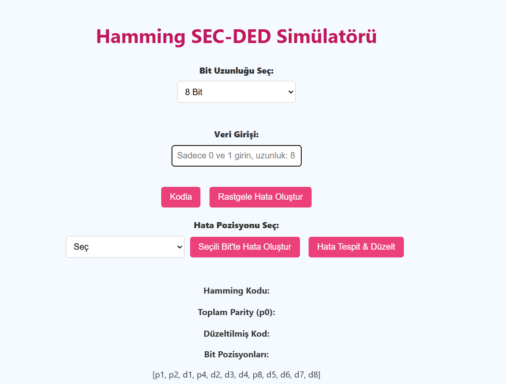
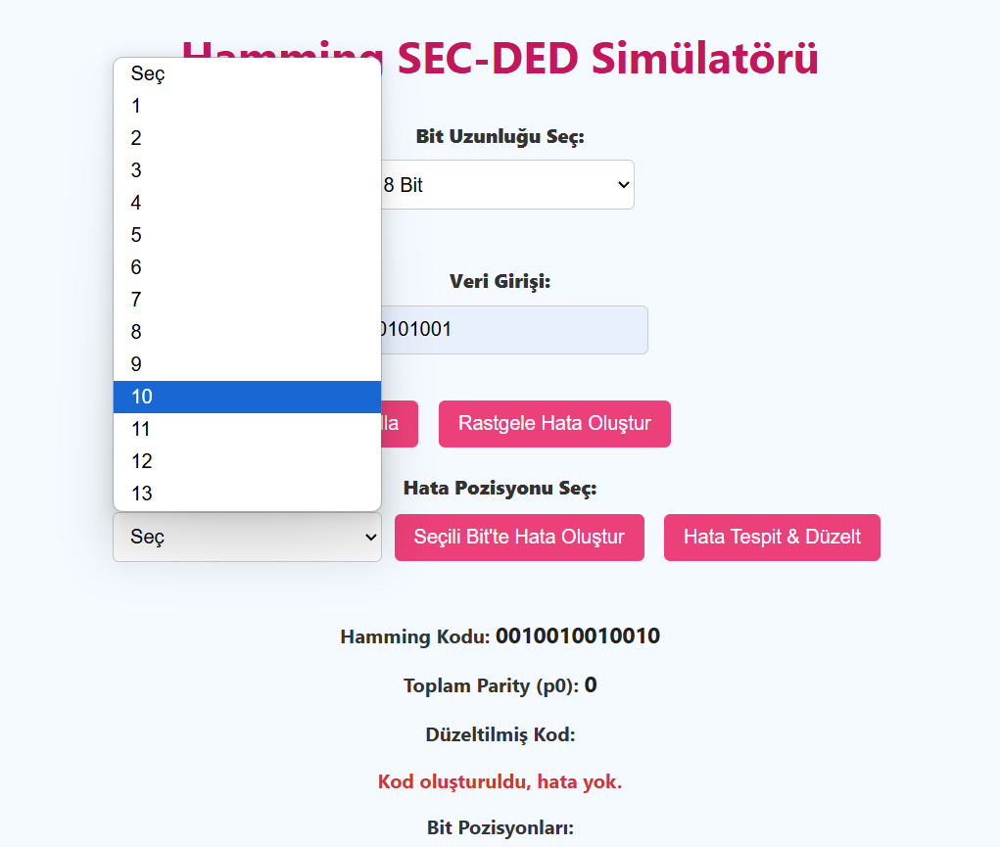
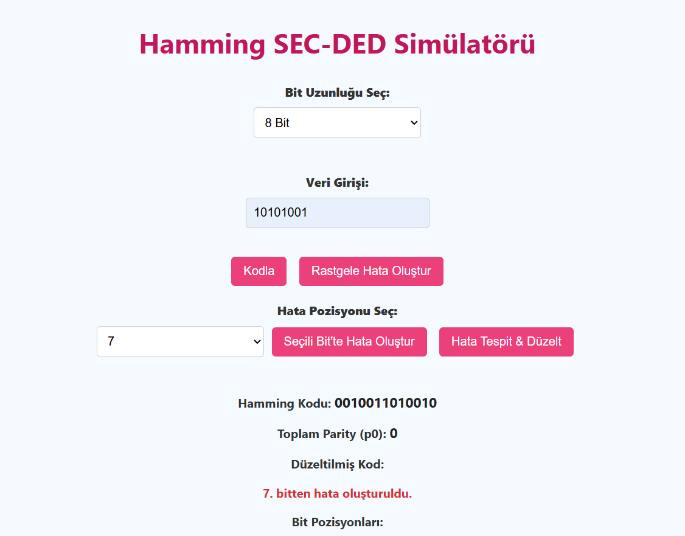
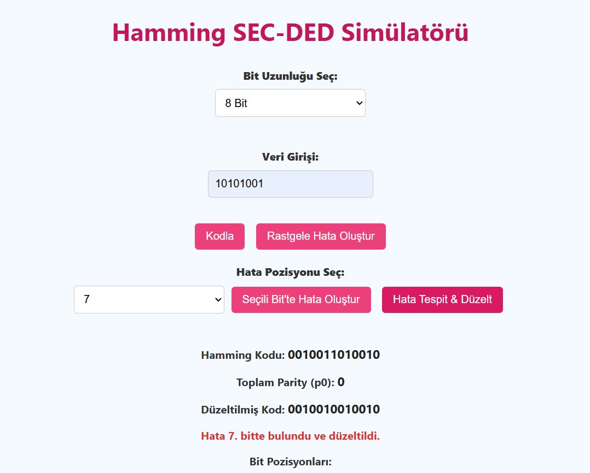
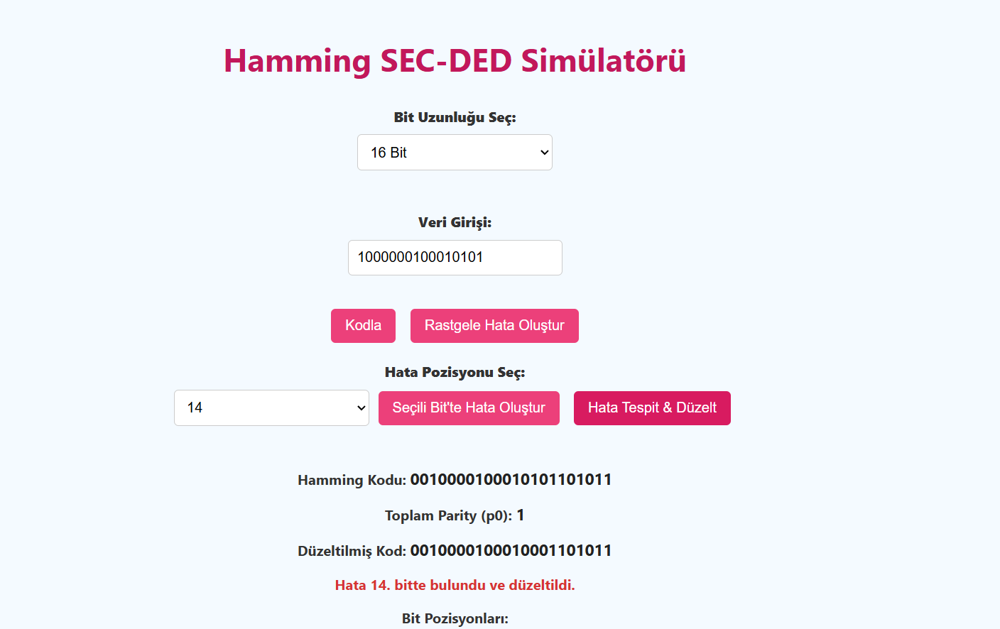
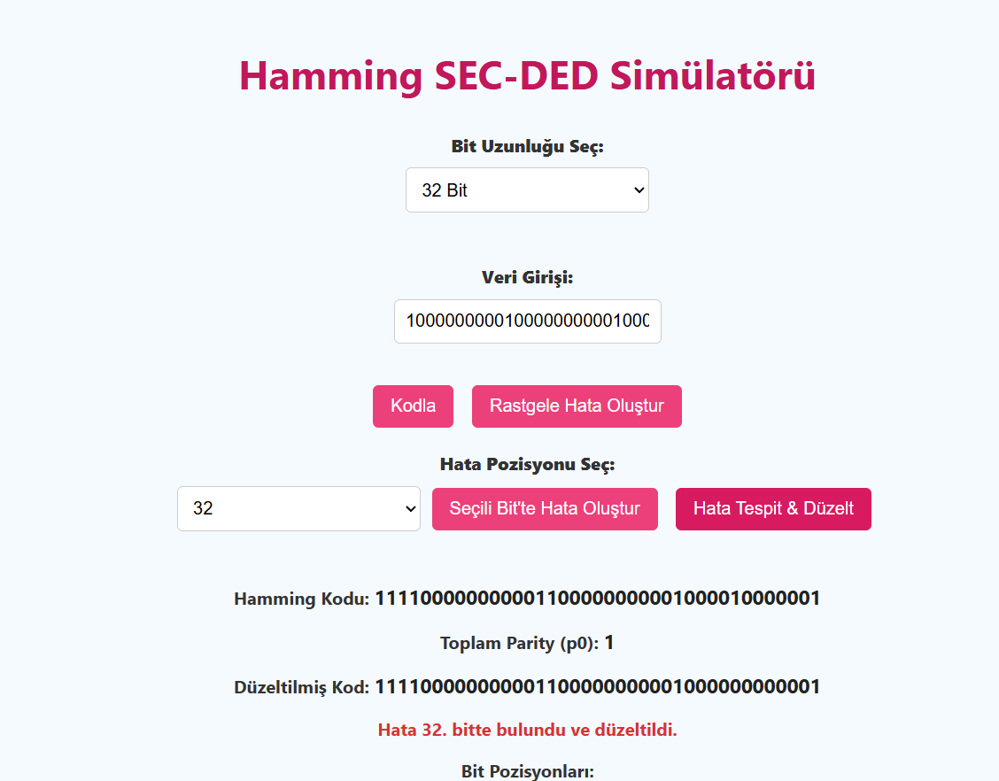

# BLM230 – Hamming SEC-DED Simülasyonu

## 📌 Proje Hakkında

Bu projede, 8, 16 ve 32 bitlik verilere Hamming SEC-DED (Single Error Correction, Double Error Detection) yöntemi uygulanarak hataya karşı dayanıklı bir veri kodlama simülatörü geliştirilmiştir. Proje, JavaScript ve HTML/CSS teknolojileri ile web tabanlı olarak tasarlanmıştır.

---

## 💻 Kullanılan Teknolojiler

- **HTML** – Arayüz oluşturmak için  
- **CSS** – Sayfa tasarımı ve görsel stil için  
- **JavaScript** – Kodlama algoritması, hata üretimi ve düzeltme işlemleri için  

---

## 🔄 Simülasyonun Adımları

1. Kullanıcı, 8, 16 veya 32 bitlik veri girişi yapar (örnek: 10101010 veya 1100110011001100)
2. “Kodla” butonuna tıklandığında, girilen veriye Hamming SEC-DED algoritması uygulanarak hata tespit ve düzeltme bitleri ile birlikte kodlanmış veri üretilir.
3. “Hata Oluştur” ile kullanıcının seçtiği bit terslenerek yapay bir hata simüle edilir.
4. “Hata Tespit & Düzelt” butonuna tıklandığında, hata sendromu hesaplanır, hata yeri bulunur ve varsa tek bitlik hata düzeltilir.
---

## 🖼️ Arayüzden Görseller

Aşağıda simülasyonun bazı ekran görüntüleri yer almaktadır:

### 1. Ana Sayfa Görünümü

### 2. Kodlanmış Veri

### 3. Hatalı Veri

### 4. Düzeltme İşlemi

### 5. Düzeltme Sonrası Sonuç

### 6. Düzeltme Sonrası Sonuç

  
---

## 🔗 Proje Bağlantıları

- 🎥 [Demo Videosu (YouTube)](https://www.youtube.com/watch?v=a_TyuVLf-qw)
- 💻 [Canlı Demo / GitHub Pages](https://rumeysaersoyy.github.io/hamming-sec-ded)

---

## 👩‍💻 Geliştirici

- **Ad Soyad:** Rumeysa Ersoy  
- **Öğrenci No:** 22360859070  
- **Ders:** BLM230 – Bilgisayar Mimarisi  
- **Dönem:** 2024-2025 Bahar  

---

## 📃 Lisans

Bu proje eğitim amaçlı geliştirilmiştir. Kaynak göstererek kullanılabilir.
